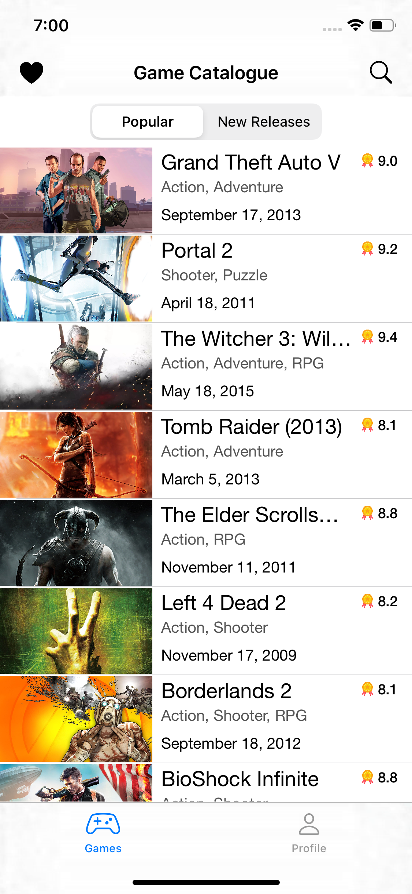
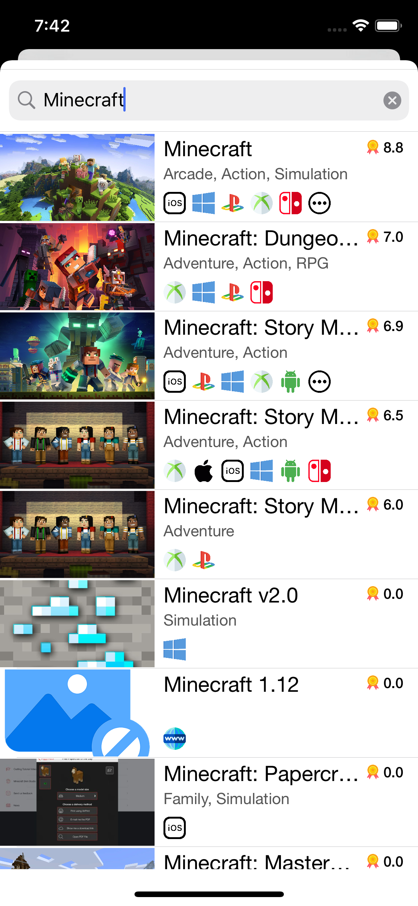
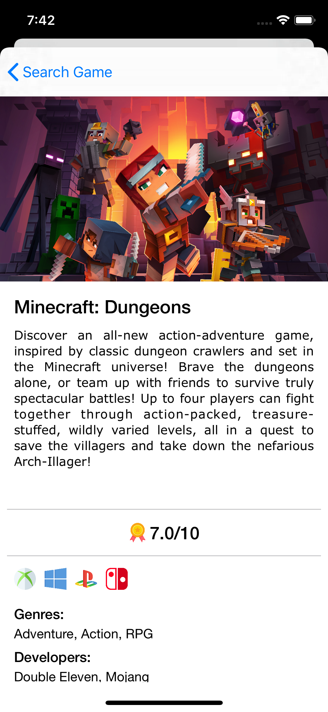
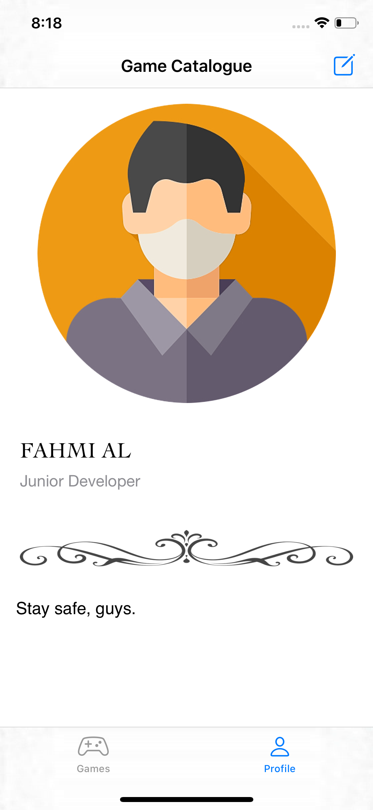

#  Game Catalogue
A simple iOS Game Catalogue that provides Games information based on RAWG.

This repository is my one of the class assignments (with a little bit modification) at Dicoding Academy online course platform at class: Learn The Fundamental of iOS Application ([Belajar Fundamental Aplikasi iOS](https://www.dicoding.com/academies/202)). I've enrolled in this class as a part of IDCamp 2020 scholarship programme by Indosat Ooredoo and Dicoding Indonesia.

## Screenshots
&nbsp;

### App Features
* [x] Fetching list games online from rawg.io
* [x] Games detail
* [x] Games
* [x] Infinite Scroll

### Licenses
- [Swift](https://swift.org/documentation)
- [RAWG](https://api.rawg.io/docs)
- [Flaticon](https://flaticon.com)

## Author
* **Muhamad Fahmi Al Kautsar**
